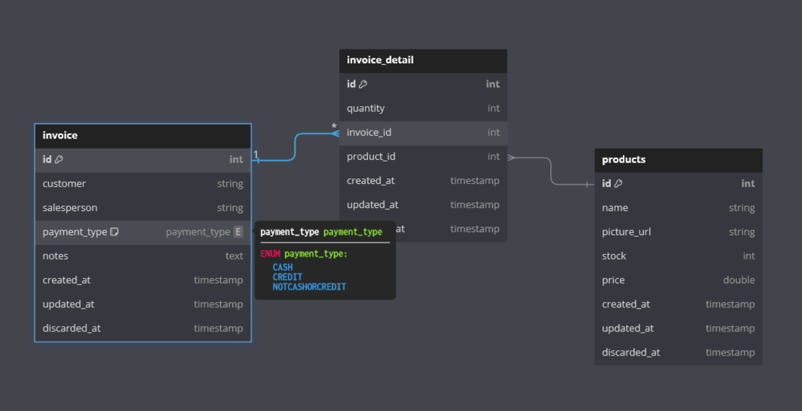

# ERD


# Your Project Name

## Description
Simple CRUD for products and invoices for widatech-api technical test

## Prerequisites

- Docker
- Docker Compose

### Environment Setup

1. Copy the example environment file:

```bash
cp .env.example .env
```

2. Open the `.env` file and update the variables as needed. The default values should work for the Docker setup.

### Running with Docker

1. Build and start the containers:

```bash
docker-compose up --build
```

This command will:
- Build the Docker image for the application
- Start the PostgreSQL database
- Run database migrations and seed data
- Start the application

2. The application should now be running and accessible at `http://localhost:8080`

### Stopping the Application
To stop the application and remove the containers along with the volumes (this will delete all data in the database):

```bash
docker-compose down -v
```

### Running Migrations Manually

If you need to run migrations manually, you can use the following command:

```bash
docker-compose exec app npm run db:setup
```

### Accessing the Database

To access the PostgreSQL database directly, you can use:

```bash
docker-compose exec db psql -U postgres -d widatech_db
```

## API Documentation

The API provides endpoints for managing products and invoices. All endpoints are prefixed with `/api`.

### Products

Base URL: `http://localhost:8080/api/product`

| Method | Endpoint | Description |
|--------|----------|-------------|
| GET    | `/`      | Get all products |
| GET    | `/:id`   | Get a product by ID |
| POST   | `/`      | Create a new product |
| PUT    | `/:id`   | Update a product by ID |
| DELETE | `/:id`   | Delete a product by ID |

### Invoices

Base URL: `http://localhost:8080/api/invoice`

| Method | Endpoint | Description |
|--------|----------|-------------|
| GET    | `/`      | Get all invoices |
| GET    | `/:id`   | Get an invoice by ID |
| POST   | `/`      | Create a new invoice |
| PUT    | `/:id`   | Update an invoice by ID |
| DELETE | `/:id`   | Delete an invoice by ID |

### Example Requests

#### Get all products

```
GET http://localhost:8080/api/product
```

#### Create a new product

```
POST http://localhost:8080/api/product
Content-Type: application/json

{
  "name": "Example Product",
  "picture_url": "https://example.com/product-image.jpg",
  "stock": 100,
  "price": 19.99
}
```

#### Create a new invoice

```
POST http://localhost:8080/api/invoice
Content-Type: application/json

{
  "customer": "John Doe",
  "salesperson": "Jane Smith",
  "payment_type": "CREDIT",
  "notes": "First purchase",
  "details": [
    {
      "quantity": 2,
      "product_id": 1
    },
    {
      "quantity": 1,
      "product_id": 2
    }
  ]
}
```

## Built With

- Node.js
- Express.js
- PostgreSQL
- Sequelize
- Docker